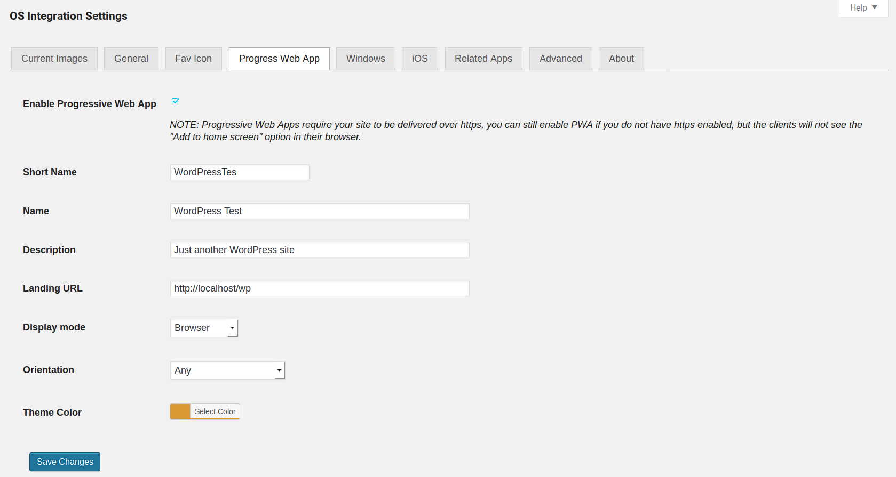
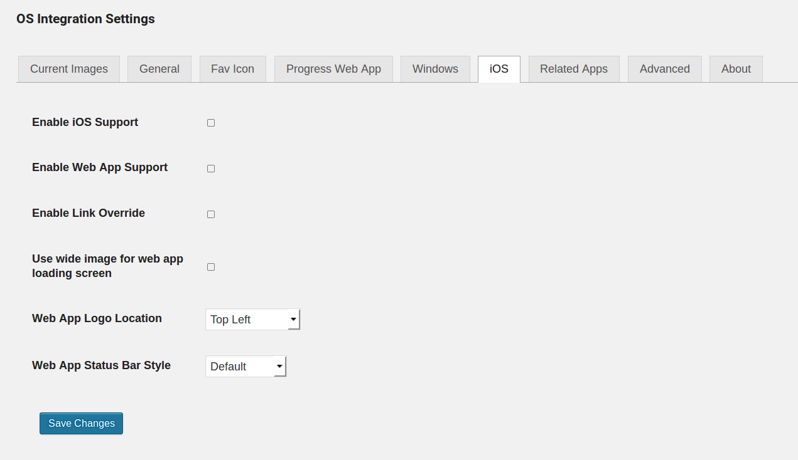
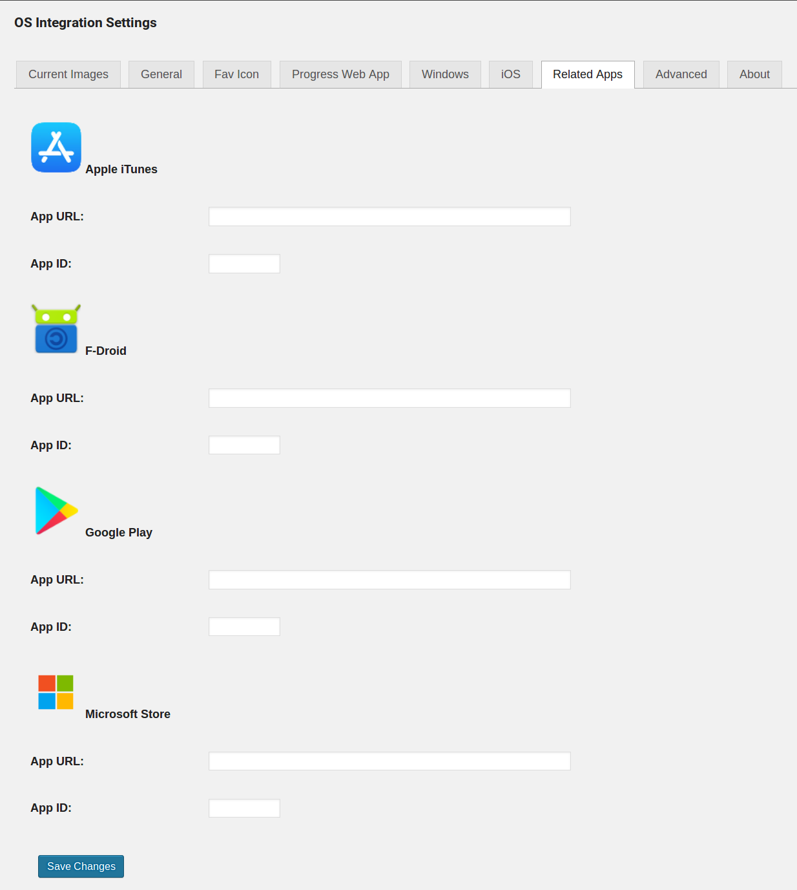
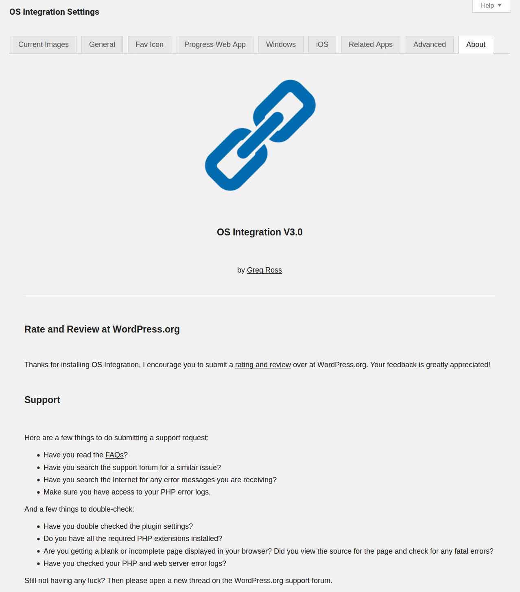
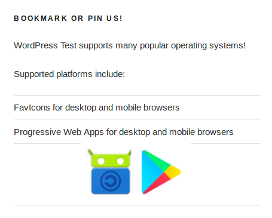

# OS Integration #
**Contributors:** [gregross](https://profiles.wordpress.org/gregross/)  
**Tags:** Windows 8, Internet Explorer, live tile, App, tiles, start screen, pinned site, favicon, iOS, Android, Windows Phone 8.1, WebApp, web app, site icon, progressive, pwa  
**Requires at least:** 3.5  
**Requires PHP:** 5.4  
**Tested up to:** 6.1.1  
**Stable tag:** 3.0  
**Description:** Integrate your site in to your users OS; Windows Live Tiles, icons for Apple and Android, iOS Web App and now Progressive Web App support!  
**License:** GPLv2  

## Description ##
User's have all kinds of devices these days and your site needs to look the best it can when being displayed, pinned or added to your users system.

WordPress 4.3 has introduced the "Site Icon" option in settings but it's far too limited, OS Integration does what it can't!

OS Integration supports the following features:

* Generation of favicon.ico, up to 96x96px.
* PNG favicon support in multiple resolutions (16, 32, 96, 160 and 196px)
* Windows 8 and 8.1 Live Tiles in all sizes
* Windows 8 Live Tile update feeds (both through buildmypinnedsite.com and local XML files)
* Support for Windows Phone 8.1 Live Tiles
* iOS Touch Icon support in multiple resolutions (57, 72, 114, 144px)
* iOS Web App support including loading screen
* iOS Web App link override mode, keep your site in the Web App even if the user clicks on a link
* Widget to notify users of bookmarking and pinning support on the site (only displays which options you have enabled)
* Progressive Web Apps (PWA), including related applications

All of the above can be supported with a single image supplied by you to the plugin and all the required formats will then be generated by OS Integration.

Optionally you can also supply a custom wide formatted imaged or override any or all the generated images with custom selections.

Why use 2, 3 or 4 other plugins when OS Integration does all the work for you!

## Installation ##
1. Extract the archive file into your plugins directory in the os-integration folder.
2. Activate the plugin in the Plugin options.
3. Login to WordPress and configure your options.

## Frequently Asked Questions ##
### Some image sizes are not generating? ###

You must provide an image larger than 450x450 (or 450x281 for the wide image).  If a smaller image is supplied the code will not resize them to a larger format.

### What PHP libraries are required? ###

The WordPress image editor is used to resize the images, which supports both GD and Image Magic.

### I've recently enabled SSL on my site, do I need to do anything? ###

OS Integration store the complete URL of the icon and images so if you enable SSL after generating the icons, you'll need to regenerate them to get the URL's updated.

### I'm running a mix SSL site and getting a mix content warning on the SSL pages because of OS Integration, how do I fix it? ###

First, don't run mixed sites, you should enable SSL on your entire site.

Having said that, the URL's for the icons and images are generated with the URL from your site configuration so you can switch it to https temporarily, generate the OS Integration files and then switch it back.

This will use SSL for all of the OS Integration links and not cause mix content warnings.

You should then look at enabling SSL on your entire site as you will otherwise have to do this each time you update your OS Integration settings.

## Screenshots ##
### 1. General settings. ###

### 2. Fav Icon settings. ###

### 3. Progressive Web App settings. ###

### 4. Windows settings. ###

### 5. iOS settings. ###

### 6. Related App settings. ###

### 7. Advanced settings. ###

### 8. About page. ###

### 9. Notification widget. ###

## Changelog ##
### 3.0 ###
* Release date: February 22, 2018
* Added: PWA support.
* Added: Language translation support.

### 2.1 ###
* Release date: September 9, 2016
* Updated: PHP_ICO library to 1.0.3 to support PHP7.
* Updated: About page.
* Fixed: Various WP_DEBUG messages.
* Fixed: Update the preview when clear button is clicked.
* Fixed: Force the preview to a fixed size.

### 2.0 ###
* Release date: July 3, 2015
* Added: Preview of image and background in the general tab.
* Added: Featured images are now supported in locally hosted XML Live Tiles.
* Added: Hooked in to the admin header load to support favicons in the admin panel.
* Added: Strip WordPress 4.3's Site Icon meta data so we don't get a conflict.
* Added: Tab to settings page to display current images.
* Updated: Only add the custom local XML feed for Windows Live Tiles if the local option has been selected and Live Tiles are enabled.
* Updated: About tab.
* Fixed: Rebuild the images when configuration changes make it necessary (like changing the background color, logo position and other settings).
* Fixed: Image Magic code now works!
* Fixed: Check to make sure the os-integration directory exists in the uploads before trying to use it.
* Fixed: Check to make sure the user has uploaded an PNG file before trying to use it and show an error message if not.
* Fixed: Don't try to generate the iOS files if an error has occurred due to the square or wide image generation.
* Fixed: Some WordPress installs would not generate the local XML feed URL correctly.
* Fixed: A really new WordPress installs (where there were not 3 posts yets) the local XML feed would create blank entries on the live tiles.

### 1.7 ###
* Release date: December 6, 2014
* Added: If no wide image is provided, one will be auto generated based on the square image being centred in the wide icon.
* Added: Check to see if both images are readable before compositing them together (avoid fatal errors if an intermediate image failed to be created correctly).

### 1.6 ###
* Release date: September 9, 2014
* Updated: Widget code now adheres to WordPress standards.
* Fixed: Missing quotation marks around DEFINE name which caused a WP_DEBUG message.
* Removed: Screen shots from the distribution archive and in to the WordPress assets directory.

### 1.5 ###
* Release date: June 5, 2014
* Fixed issue with ios icons being 'forgotten' if you changed settings with an image rebuild required.
* Added support for link overriding in WebApp mode

### 1.2 ###
* Release date: May 29, 2014
* Added widget to let users know they can bookmark or pin the site.

### 1.1 ###
* Release date: April 23, 2014
* Added support for iOS icon and WebApp titles.
* Tested with Windows Phone 8.1 Live Tiles.
* Tested with WordPress 3.9.

### 1.0 ###
* Release date: April 3, 2014
* Incremented version to 1.0.

### 0.6 ###
* Release date: March 25, 2014
* Fixed: iOS image settings not saving correctly.
* Fixed: iOS html output not being generated.

### 0.5 ###
* Release date: March 21, 2014
* Initial code.

## Upgrade Notice ##
### 3.0 ###
* Support for Progressive Web Apps is now available, go to the settings to enable it.

